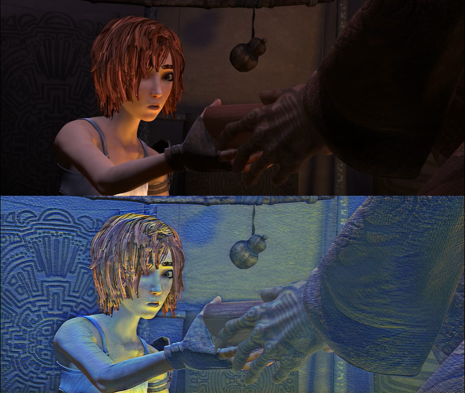

# reconet-torch
This repository contains a PyTorch implementation of the [ReCoNet paper](https://arxiv.org/pdf/1807.01197.pdf). It use a lot of code from [safwankdb](https://github.com/safwankdb/ReCoNet-PyTorch)

### Contributors:
- [Mohd Safwan](https://github.com/safwankdb)
- [Kushagra Juneja](https://github.com/kushagra1729)
- [Saksham Khandelwal](https://github.com/skq024)
- [safwankdb](https://github.com/safwankdb)

[](videos/output_shaman_1_concat01_10.avi)


## dataset
we use the MPI Sintel Dataset. The dataset contains flow fields, motion boundaries, unmatched regions, and image sequences. The image sequences are rendered with different levels of difficulty.

# Train

```bash
python train.py --phase train --path mpidataset
```

# video

```bash
python video_cv2.py --video-name 'avi/output_style.avi' --mode video_style --save-directory trained_models --model-name model.pth
```


**notice**
You can use optim.Adam(), it results bubble artifacts. I used optim.Adamax() in my code.


